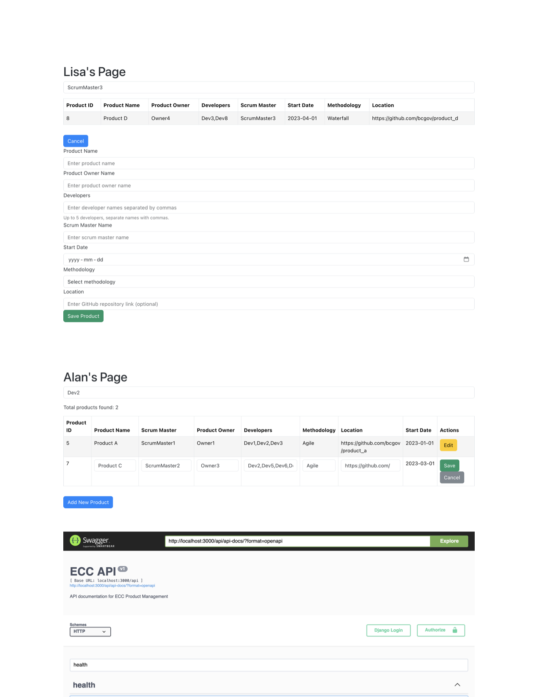

# ECC Product Management



## Introduction

ECC Product Management is a web application designed to catalog and manage products in various stages of development and maintenance. It ensures simplicity for users with diverse technical skills.

## How It Meets the Requirements

### 1. **GitHub Repository**
   The project is hosted on a GitHub repository, adhering to the naming convention specified.

### 2. **Modern Backend API Framework**
   - The backend API is developed using Django, a modern backend API framework.
   - Endpoints are provided for performing CRUD operations on products.
   - Sample JSON schema and pre-populated data are used to manage products without requiring a database.
   
### 3. **Modern Frontend Web Application Framework**
   - The frontend is developed using React, providing a user-friendly interface.
   - Implements user stories 1-3, providing basic functionality for adding, viewing, and editing product details.
   - Clearly labeled buttons, forms, and a clean layout ensure effortless navigation within the application.

### 4. **BONUS: Swagger Documentation** 
   Swagger documentation, providing comprehensive documentation of the API endpoints, can be accessed and utilized at [http://localhost:3000/api/api-docs/](http://localhost:3000/api/api-docs/) after the backend is running.

### 5. **BONUS: Search Feature**
   - Implemented in user stories 4 and 5, allowing users to search for products by Scrum Master or Developer.

## How to Run the Project using Docker

### Prerequisites
Ensure Docker is installed on your machine. If not, follow the [official guide](https://docs.docker.com/get-docker/) to install Docker.

### Steps to Run the Project
1. **Clone the Repository:**
  ```
   git clone https://github.com/prbl/alex-chen-ecc-dssb-IS24-code-challenge
  ```

2. **Navigate to the Project Directory:**
  ```
   cd alex-chen-ecc-dssb-IS24-code-challenge
  ```

3. **Build and Run using Docker-Compose:**
  ```
   docker-compose up --build
  ```
   Note: If needed, use `sudo` before docker commands for permissions.

4. **Access the Application:**
   - Frontend: Open a web browser and navigate to [http://localhost:8000/](http://localhost:8000/)
   - Backend API: Accessible at [http://localhost:3000/api/](http://localhost:3000/api/)
   - Swagger Documentation: Available at [http://localhost:3000/api/api-docs/](http://localhost:3000/api/api-docs/)

5. **Stop the Containers:**
   Once you've finished using the application, you can stop the Docker containers using:
  ```
   docker-compose down
  ```

### Note
If you encounter any issues, ensure Docker is running on your machine, and ports 3000 and 8000 are not being used by other applications. For further details or troubleshooting, kindly refer to the Docker documentation or get in touch with the development team.
